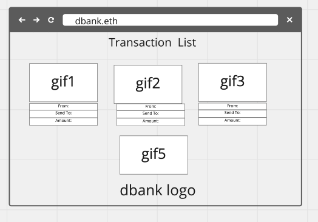
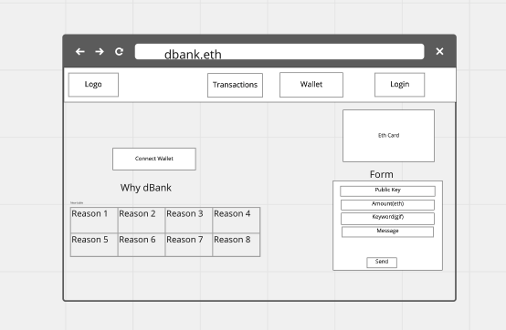
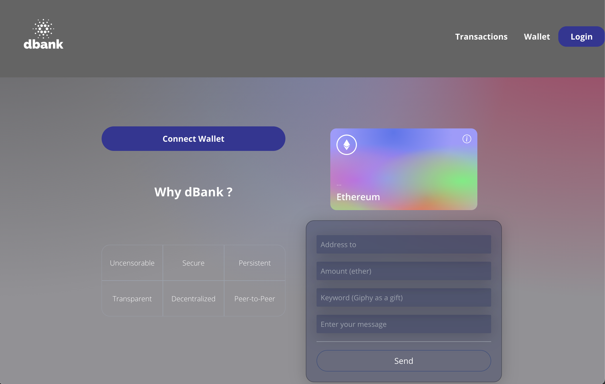
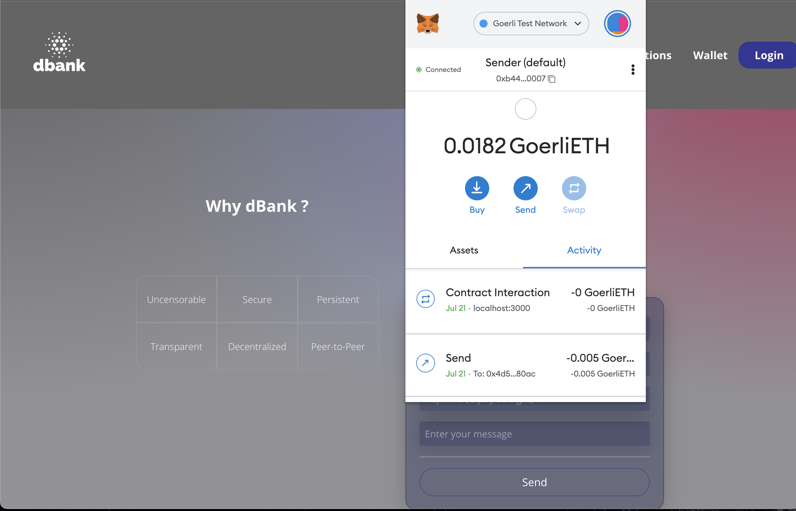

<h1>dBank</h1>

## Table of Contents

- [Project Description](#project-description)
- [Wireframes](#wireframes)
- [User Stories](#user-stories)
- [Goals](#goals)
- [MVP](#mvp)
- [Stretch Goals](#stretch-goals)
- [Tech Stack](#tech-stack)
- [Daily Sprints](#daily-sprints)

## Project Description

 dBank is a crypto marketplace where you can interact with and learn about crypto currencies. In this single page web application, you can buy/sell crypto currencies, and send/receive crypto currencies.
 The application will be used by crypto traders, and crypto investors. Users data will be stored in decentralized, persistent and append-only ledger.

## Wireframes

## Screen Shots of the Project

## User Stories

- [x] As a user, I want to be able to login to the application with Metamask wallet.
- [ ] As a user, I want to be able to create an account.
- [ ] As a user, I want to be able to logout of the application.
- [x] As a user, I want to be able to see my transactions.
- [x] As a user, I want to be able to send crypto currencies to other users.
- [ ] As a user, I want to be able to receive crypto currencies from other users.
- [ ] As a user, I want to be able to buy crypto currencies.
- [ ] As a user, I want to be able to sell crypto currencies.

## Goals

- [x] Create a blockchain based application.
- [ x Connect to a blockchain wallet(Metamask).
- [ ] Create a user login.
- [x] Pairing users with a wallet.
- [x] Wallet interaction with smart contract.
- [ ] Sending and receiving Ethereum and other crypto currencies.
- [x] Add gif when transactions are made.
- [ ] Buying and selling Ethereum and other crypto currencies.
- [x] Showing transactions.
- [ ] Showing user's balance.
- [ ] Showing real time price of crypto currencies.
- [ ] Having educational features.
- [ ] Having a user friendly interface and minimalist design.

### MVP

- [x] Create a user login.
- [x] Showing transactions.
- [x] Writing smart contract with Solidity.
- [x] Add gif when transactions are made.
- [x] Create a blockchain based application.
- [x] Having a user friendly interface and minimalist design.
- [x] Pairing users with a wallet.
- [x] Wallet interaction with smart contract.
- [x] Sending Ethereum to the another address.
- [x] Connect to a blockchain wallet(Metamask).

### Stretch Goals

- [x] Sending and receiving Ethereum and other crypto currencies.
- [ ] Receiving Ethereum from the another address.
- [ ] Buying and selling Ethereum and other crypto currencies.
- [ ] Showing user's balance.
- [ ] Showing real time price of crypto currencies.
- [ ] Having educational features.

## Tech Stack

- React with Tailwind will be used for client side.
- Solidity will be used for smart contract.
- Metamask will be used for wallet interaction.
- Heroku will be used for deployment.
- Npm will be used for package management.
- Hardhat will be used for testing.
- Github will be used for version control.
- VS Code will be used for code editing.

## Daily Sprints

- Thursday:
  - Working on planning the application.
  - Review of React and Tailwind.
  - Implementing components.
- Friday:
  - Implement navigation bar.
  - Implement client side.
- Saturday:
  - Continue implement client side.
  - Fetching data from Giphy Api.
  - Study of Solidity.
- Sunday:
  - Implement smart contract.
  - Pairing users with a wallet.
- Monday:
  - Continue Implement smart contract.
  - Wallet interaction with smart contract.
- Tuesday:
  - Rendering transactions.
  - Reviewing code.

  <h2>Author</h2>
  <h3> </h3>
 
  
  

   

